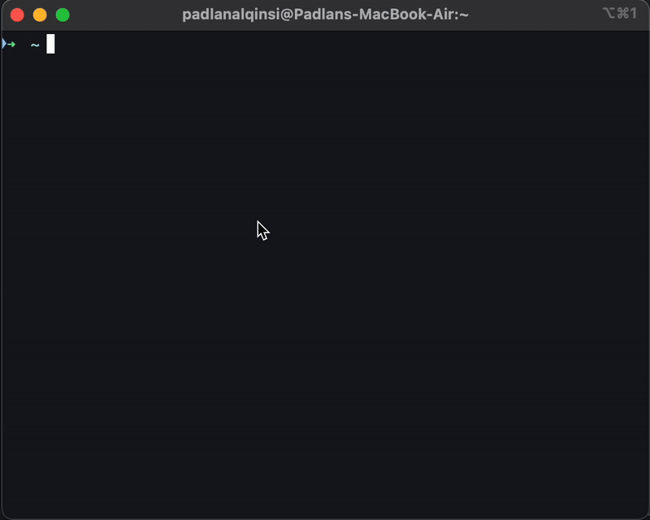

# Orchestrator

This project implements a chat orchestrator using LangGraph and streaming responses. It leverages a SQL agent to interact with a database and a Gemini model to generate natural language responses.

**Disclaimer:** This project is for demonstration purposes only. The SQL agent is a dummy and does not interact with a real database.

```text
Question: berikan 20 list desa dengan jumlah penduduk paling banyak
```



## Features

-   **LangGraph Integration:** Utilizes LangGraph for defining and managing the workflow of the chat application.
-   **SQL Agent:** Integrates with a SQL agent to execute database queries based on user input.
-   **Gemini Model:** Employs the Gemini model for natural language generation and understanding.
-   **Streaming Responses:** Provides real-time streaming of responses to the user, enhancing the interactive experience.
-   **FastAPI:** Uses FastAPI for building the API endpoints.
- **Stream Event:** Implements stream event for last answer.

## Architecture

The application follows a modular architecture:

-   **API:** Defines the API endpoints for user interaction.
-   **Graph:** Defines the LangGraph workflow.
-   **LLM:** Contains the Gemini model integration.
-   **State:** Manages the state of the chat conversation.
-   **Tools:** Contains the SQL agent and the final answer agent.

## Setup

1.  **Environment Variables:**
    -   Create a `.env` file in the root directory.
    -   Add your Gemini API key:
        ```
        GEMINI_API_KEY=your_gemini_api_key
        GEMINI_MODEL_NAME=gemini-2.0-flash
        ```

2.  **Installation:**
    -   Install the required packages using Poetry:
        ```bash
        poetry install
        ```

3.  **Running the Application:**
    -   Start the FastAPI application:
        ```bash
        uvicorn src.main:app --reload
        ```

## Usage

-   Send a GET request to `/chat` with a `query` parameter to start a conversation.
    ```
    http://localhost:8000/chat?query=your_query
